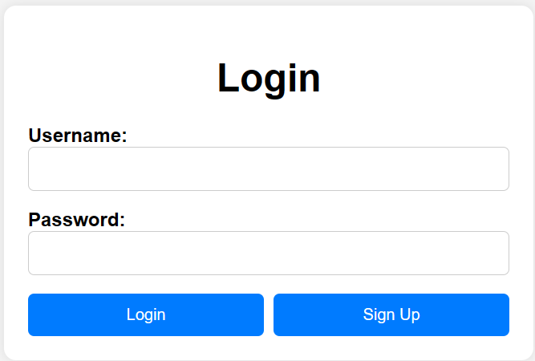
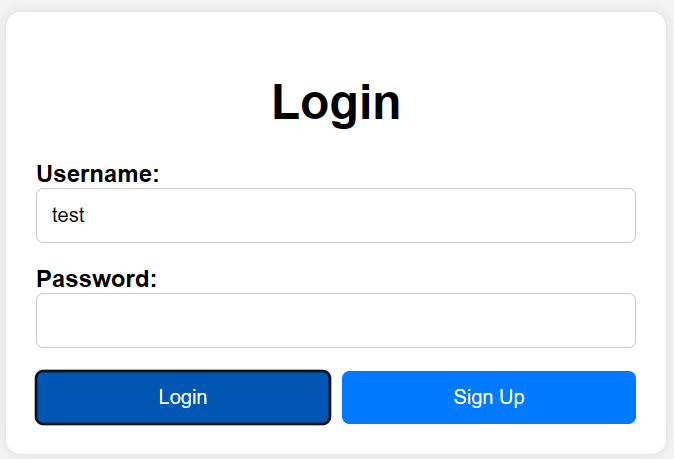

### CSS
Bayangkan kamu punya selembar kertas besar di depanmu, dan kamu ingin membuat halaman login di dalamnya seperti yang sering kamu lihat di situs web. Jika halaman tersebut biasa saja terlihat membosankan bukan? nah css ini buat mengatur file html.

### 1. Body
```css
body {
    font-family: Arial, sans-serif;
    background-color: #f4f4f4;
    margin: 0;
    padding: 0;
    display: flex;
    justify-content: center;
    align-items: center;
    height: 100vh;
}
```
Ini adalah bagian CSS yang memberikan instruksi untuk tata letak dan gaya umum dari elemen-elemen dalam badan (body) halaman web. Ini termasuk jenis huruf, warna latar belakang, dan tata letak halaman secara keseluruhan.
### 2. Card
```css
.card {
    background-color: #fff;
    padding: 20px;
    border-radius: 10px;
    box-shadow: 0 0 10px rgba(0, 0, 0, 0.1);
    max-width: 400px;
    width: 100%;
}
```
 Ini adalah kelas CSS yang memberikan gaya untuk elemen dengan kelas "card". Ini termasuk warna latar belakang, bayangan (shadow), dan bentuk sudut (border-radius) untuk memberikan tampilan kartu pada elemen tersebut.
### 3. h1
```css
h1 {
    text-align: center;
    margin-bottom: 20px;
}
```
Ini adalah gaya untuk elemen judul level 1 (h1). Ini menentukan tata letak teks judul dan margin (jarak) di bawah judul.
### 4. Label
```css
label {
    font-weight: bold;
}
```
### 5. input[type="text"], input[type="password"]
```css
input[type="text"],
input[type="password"] {
    width: 100%;
    padding: 10px;
    margin-bottom: 15px;
    border: 1px solid #ccc;
    border-radius: 5px;
    box-sizing: border-box;
}
```
Ini adalah gaya untuk elemen label. Dalam hal ini, gaya yang diberikan adalah font tebal (bold) untuk teks label.
### 6. .login-button, .signup-button
```css
.login-button,
.signup-button {
    width: 49%;
    background-color: #007bff;
    color: #fff;
    padding: 10px;
    border: none;
    border-radius: 5px;
    cursor: pointer;
}
```
Ini adalah gaya untuk tombol login dan tombol sign up. Ini menentukan tampilan, termasuk warna latar belakang, warna teks, padding, border, border-radius, dan cursor.
### 7. .login-button:hover, .signup-button:hover:
```css
.login-button:hover,
.signup-button:hover {
    background-color: #0056b3;
}
```
Ini adalah gaya tambahan untuk tombol login dan tombol sign up saat dihover oleh mouse. Ini mengubah warna latar belakang tombol untuk memberikan umpan balik visual kepada pengguna.
### 8. .button-container
```css
.button-container {
    display: flex;
    justify-content: space-between;
}
```
Ini adalah kelas CSS yang memberikan tata letak dari tombol-tombol login dan sign up. Ini menyusun tombol-tombol tersebut secara horizontal dengan jarak yang sama di antara keduanya.

Jadi, ketika kamu menambahkan semua ini ke halaman HTML-nya, kamu akan mendapatkan halaman login yang tampak seperti kartu dan berada di tengah layar! Semoga penjelasan ini membantu kamu memahaminya dengan lebih baik!

Hasil akhir semua source code css:
```css
body {
    font-family: Arial, sans-serif;
    background-color: #f4f4f4;
    margin: 0;
    padding: 0;
    display: flex;
    justify-content: center;
    align-items: center;
    height: 100vh;
}

.card {
    background-color: #fff;
    padding: 20px;
    border-radius: 10px;
    box-shadow: 0 0 10px rgba(0, 0, 0, 0.1);
    max-width: 400px;
    width: 100%;
}

h1 {
    text-align: center;
    margin-bottom: 20px;
}

label {
    font-weight: bold;
}

input[type="text"],
input[type="password"] {
    width: 100%;
    padding: 10px;
    margin-bottom: 15px;
    border: 1px solid #ccc;
    border-radius: 5px;
    box-sizing: border-box;
}

.login-button,
.signup-button {
    width: 49%;
    background-color: #007bff;
    color: #fff;
    padding: 10px;
    border: none;
    border-radius: 5px;
    cursor: pointer;
}

.login-button:hover,
.signup-button:hover {
    background-color: #0056b3;
}

.button-container {
    display: flex;
    justify-content: space-between;
}
```
Jadi hasil akhirnya akan seperti ini di website


Ketika cursor diarahkan ke tulisan "Login" atau "Sign Up" maka warna dari backgroundnya akan menjadi lebih gelap seperti contoh dibawah ketika cursor diarahkan ke bagian Login maka warnanya sedikit lebih gelap daripada Sign Up


Setelah mendefinisikan gaya untuk tampilan halaman web menggunakan CSS, kita bisa menggunakan JavaScript untuk menambahkan fungsionalitas interaktif ke halaman tersebut. Dalam halaman login, kita bisa menggunakan JavaScript untuk memvalidasi input pengguna sebelum mengirimkan formulir.
Kembali ke [HTML](../HTML/Materi.md) Lanjut ke [JavaScript](../JavaScipt/Materi.md)
