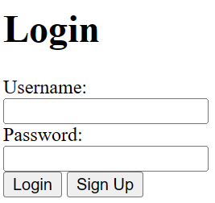

# Login Page HTML

Bayangkan kamu ingin membuat sebuah kertas kosong di internet yang bisa digunakan orang untuk masuk ke situs webmu. Ini disebut sebagai halaman login.


### 1 Tulis "Login" Dibagian atas halaman
```html
<h1>Login</h1>
```

### 2 Tambahkan dua kotak untuk mereka menulis nama pengguna dan kata sandi
```html
<label for="username">Username:</label>
<input type="text" id="username" name="username"><br><br>

<label for="password">Password:</label>
<input type="password" id="password" name="password"><br><br>
```

### 3 Tambahkan tombol "Login" yang ketika ditekan akan mengirimkan informasi tersebut
```html
<input type="submit" value="Login">
```

Jadi ketika menggabungkan semuanya, hasil lengkapnya seperti ini:
```html
<!DOCTYPE html>
<html lang="en">
<head>
<meta charset="UTF-8">
<meta name="viewport" content="width=device-width, initial-scale=1.0">
<title>Login Page</title>
</head>
<body>

<h1>Login</h1>

<form action="submit.php" method="POST">
    <label for="username">Username:</label><br>
    <input type="text" id="username" name="username"><br><br>

    <label for="password">Password:</label><br>
    <input type="password" id="password" name="password"><br><br>

    <input type="submit" value="Login">
</form>

</body>
</html>
```
Dan hasil akhirnya akan menjadi seperti ini


Dalam contoh di atas, saat tombol "Login" ditekan, informasi yang dimasukkan oleh pengguna (nama pengguna dan kata sandi) akan dikirimkan ke submit.php untuk diproses lebih lanjut. submit.php adalah file PHP yang harus kamu buat untuk menangani data yang dikirimkan dari formulir login ini.

Nah jadi gimana? udah bisa bikin halaman loginnya? tapi bosenin banget kan ya? sekarang kita coba tambahkan cssnya. [LANJUT CSS :D](../CSS/materi.md)

