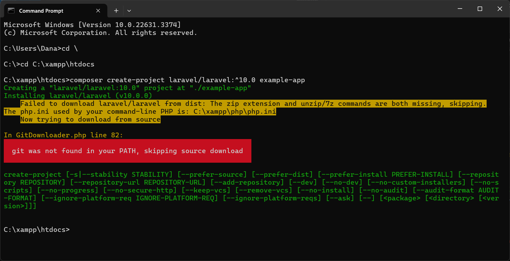
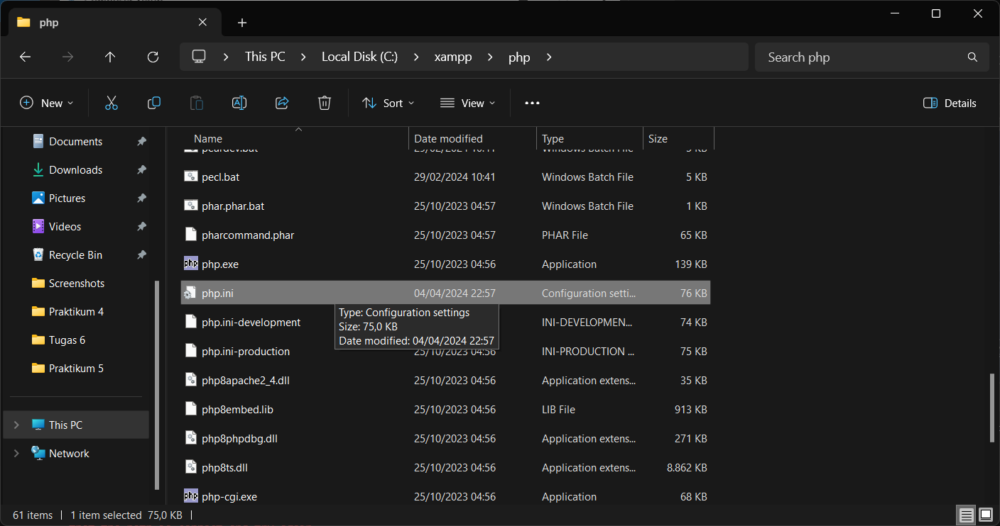
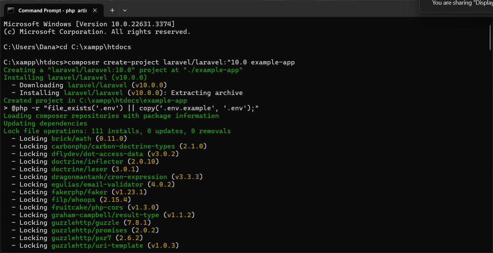
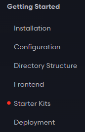
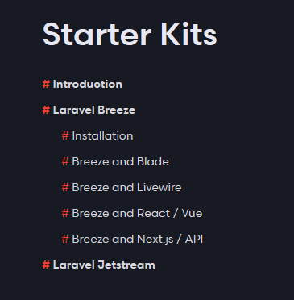

# Instalasi Laravel 10

Untuk menginstall Laravel 10, kamu harus menginstall aplikasi in iterlebih dahulu:

Composer-Setup.exe


Setelah selesai instalasi, buka Command Prompt lalu ketikkan kode ini:

```
cd C:\xampp\htdocs
```
Lalu jalankan kode ini:
```
composer create-project laravel/laravel:^10.0 example-app
```
"example-app" pada kode diatas merupakan nama Folder yang akan dibuat, nama foldernya bisa apa saja selama kata nya tidak terpisah oleh space/spasi


Apabila terjadi error seperti dibawah ini:


Buka file Explorer, navigasi ke C: >> xampp >> php, lalu buka file php.ini.



Ketik Ctrl + F untuk membuka Find Box.


Hapus titik koma (;) pada bagian kanannya "extension=zip", Sehingga jadi seperti ini:


Kemudian Save file lalu close.

Setelah itu, jalankan kembali kode ini di Command Prompt:

```
cd C:\xampp\htdocs
```
Lalu jalankan kode ini:
```
composer create-project laravel/laravel:^10.0 example-app
```

Setelah kode di jalankan, maka tampilan Command Prompt akan menjadi seperti ini:



Lalu tunggu proses hingga mencapai akhir.


Setelah itu, masukkan kode ini di Command Prompt:

```
cd example-app
```
```
php artisan serve
```

Tunggu hingga tampilan menjadi seperti ini:


Lalu copy-paste "http://127.0.0.1:8000" dari Command Prompt ke browser.


# Sekarang kita mencoba untuk membuat Login dan Register di Laravel 10

Step 1: Buka kembali website Laravel lalu cari Starter Kits lalu Breeze and Blade



Setelah itu kita liat di sebelah terdapat tulisan Breeze and Blade lalu kita klick



Nanti akan langsung mengarahkan ke sini


Sekarang kalian buka visual studio code kalian lalu buka file Laravel yang tadi kalian buat lalu buka terminal dengan shortcut (ctrl + `) atau kalian bisa mencari di pojok atas kiri tulisan **Terminal**.

Setelah itu kalian copy ini dan paste ke dalam terminal terlebih dahulu:

```
composer require laravel/breeze --dev
```

Setelah proses selesai, kalian copy dan paste lagi kode yang berada di tag Breeze dan Blade. **Harap memasukkan kode nya 1 1 tidak semua**

```
php artisan breeze:install
```

Ketika muncul kata-kata seperti ini pilih **0**.


Jika kalian muncul seperti ini pilih **blade**.


Silahkan tunggu sampai proses selesai, ketika muncul seperti ini tekan **Enter** saja.


Ketika sudah selesai dan muncul seperti ini pilih **0** dan tunggu sampai selesai.


Coba kalian cek di terminal dengan scroll ke atas apakah ada error atau tidak, biasanya terdapat error seperti dibawah ini.


Cara mengatasinya dengan membuka **package.json** lalu tambahkan kode ini dibawah "private":

```
"type": "module",
```

Sehingga kode keseluruhan menjadi seperti berikut:

```
{
    "private": true,
    "type": "module",
    "scripts": {
        "dev": "vite",
        "build": "vite build"
    },
    "devDependencies": {
        "@tailwindcss/forms": "^0.5.2",
        "alpinejs": "^3.4.2",
        "autoprefixer": "^10.4.2",
        "axios": "^1.1.2",
        "laravel-vite-plugin": "^0.7.2",
        "postcss": "^8.4.31",
        "tailwindcss": "^3.1.0",
        "vite": "^4.0.0"
    }
}
```

ketika sudah dipastikan kode seperti itu maka jalankan kembali kode ini dan tunggu sampai berhasil.

```
php artisan breeze:install
```

Ketika sudah memastikan kode tidak ada error di terminal maka bisa langsung lanjut kode yang dibawah ini:

```
php artisan migrate
```

Biasanya terdapat error dibagian SQL nya contoh seperti ini:


Maka solusi yang bisa kita gunakan adalah menggunakan kode dibawah ini:

Step 1: Cari file bernama **AppServiceProvider.php**

Step 2: Tambahkan kode ini di dalam file 
```
use Illuminate\Support\Facades\Schema;
```
Step 3: Tambahkan juga kode ini didalam file
```
public function boot()
{
    Schema::defaultStringLength(191)
}
```

Sehingga kode keseluruhan menjadi:
```
<?php

namespace App\Providers;

use Illuminate\Support\ServiceProvider;
use Illuminate\Support\Facades\Schema;

class AppServiceProvider extends ServiceProvider
{
    /**
     * Register any application services.
     */
    public function register(): void
    {
        //
    }

    /**
     * Bootstrap any application services.
     */
    public function boot(): void
    {
        Schema::defaultStringLength(191);
    }
}
```

Step 4: cari file bernama **.env**

Step 5: buka aplikasi xampp lalu start apache dan MySQL seperti ini:


Pastikan **DB_PORT** sesuai dengan yang ada di aplikasi xampp

Step 6: Buka website lalu ketik **localhost** lalu klik bagian **phpMyAdmin**


Step 7: Setelah muncul seperti ini.


Website akan berubah seperti ini


Lalu kalian bikin **Database name** sesuai dengan yang ada di file **.env** kalian bisa cek di **DB_DATABASE**

Step 8: Ketika sudah dipastikan nama database nya benar dan portnya benar kalian bisa mengulang kode yang ditaruh di terminal tadi.

```
php artisan migrate
```

Ketika berhasil akan muncul **done** seperti ini


Pastikan kode sebelumnya bisa berjalan dengan benar, ketika sudah kita lanjut 2 kode dibawah ini.

```
npm install
```

```
npm run dev
```

Ketika sudah muncul link yang tersedia dari terminal kita buat terminal baru dengan dengan klik logo **+** di sebelah kanan lalu gunakan kode dibawah ini.

```
php artisan serve
```

Ketika sudah muncul link nya kalian bisa klik link tersebut dan menuju kesebuah website. Ketika sudah muncul website nya, kalian bisa klik register disebelah kanan atas dan silahkan memasukkan username, password, dan email aktif kalian. Jika sudah berhasil maka akan muncul tulisan seperti ini:


