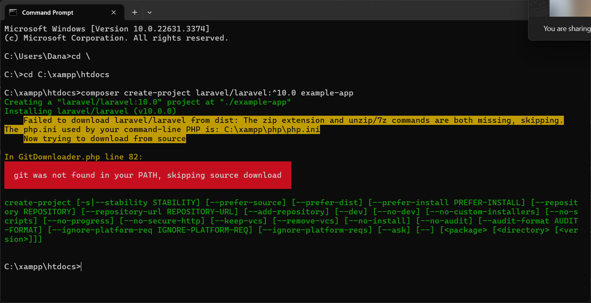
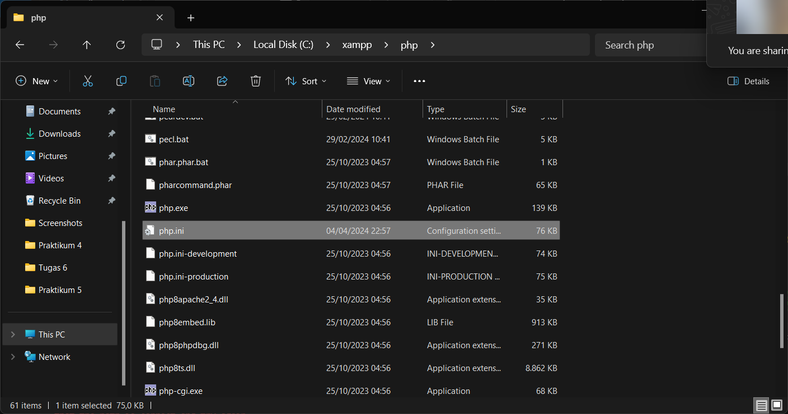
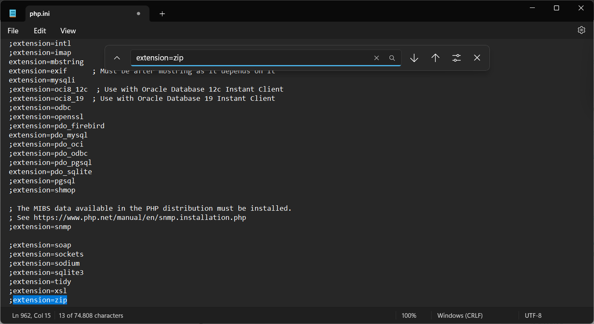
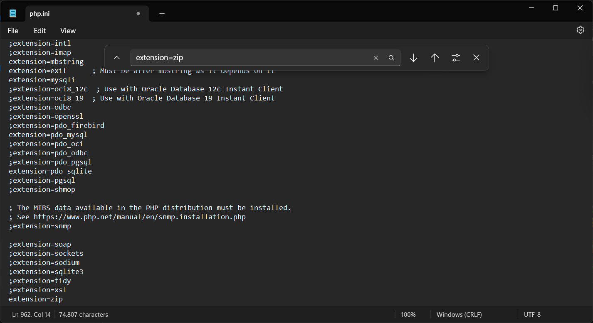
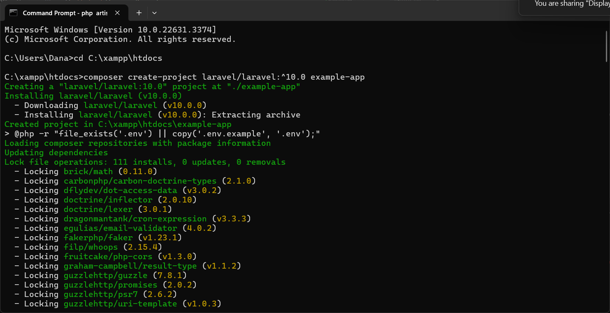
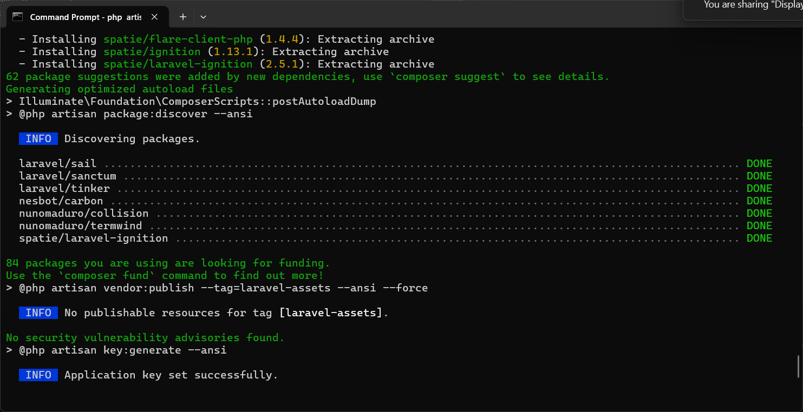
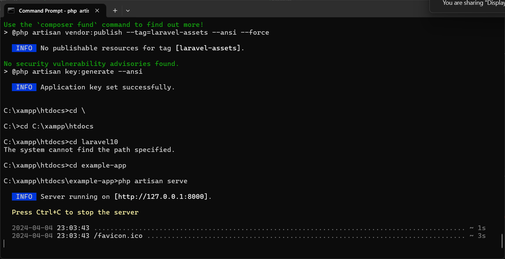
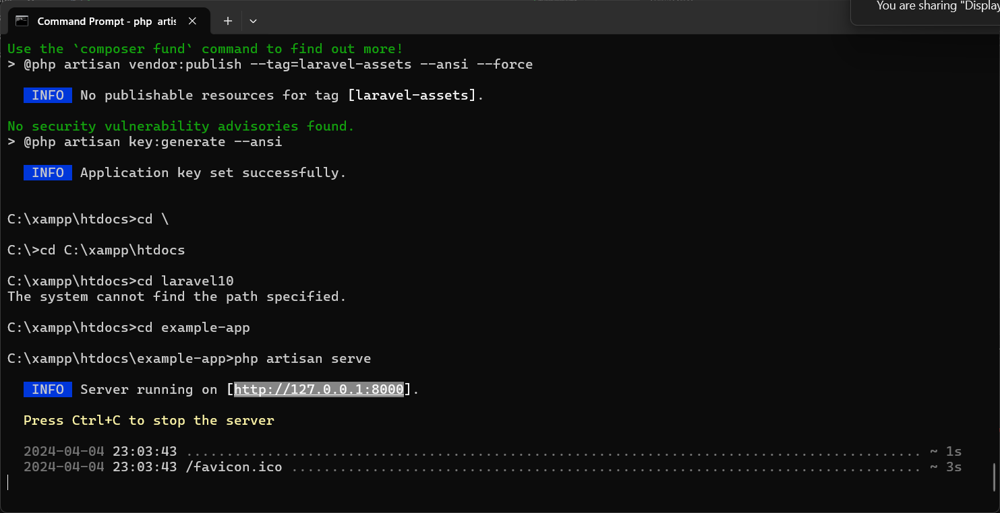
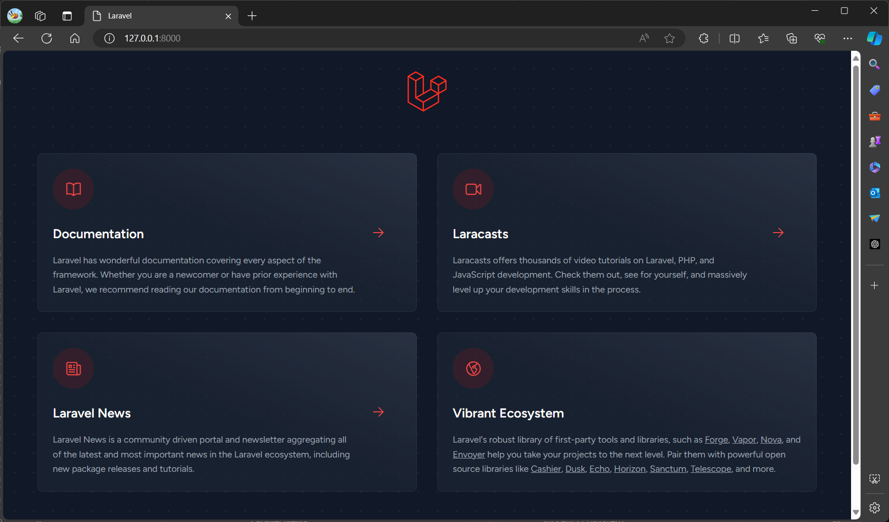

# Instalasi Laravel 10

Untuk menginstall Laravel 10, kamu harus menginstall aplikasi in iterlebih dahulu:

Composer-Setup.exe


Setelah selesai instalasi, buka Command Prompt lalu ketikkan kode ini:

```
cd C:\xampp\htdocs
```
Lalu jalankan kode ini:
```
composer create-project laravel/laravel:^10.0 example-app
```
"example-app" pada kode diatas merupakan nama Folder yang akan dibuat, nama foldernya bisa apa saja selama kata nya tidak terpisah oleh space/spasi


Apabila terjadi error seperti dibawah ini:


Buka file Explorer, navigasi ke C: >> xampp >> php, lalu buka file php.ini.



Ketik Ctrl + F untuk membuka Find Box.



Hapus titik koma (;) pada bagian kanannya "extension=zip", Sehingga jadi seperti ini:



Kemudian Save file lalu close.

Setelah itu, jalankan kembali kode ini di Command Prompt:

```
cd C:\xampp\htdocs
```
Lalu jalankan kode ini:
```
composer create-project laravel/laravel:^10.0 example-app
```

Setelah kode di jalankan, maka tampilan Command Prompt akan menjadi seperti ini:



Lalu tunggu proses hingga mencapai akhir.



Setelah itu, masukkan kode ini di Command Prompt:

```
cd example-app
```
```
php artisan serve
```

Tunggu hingga tampilan menjadi seperti ini:



Lalu copy-paste "http://127.0.0.1:8000" dari Command Prompt ke browser.




