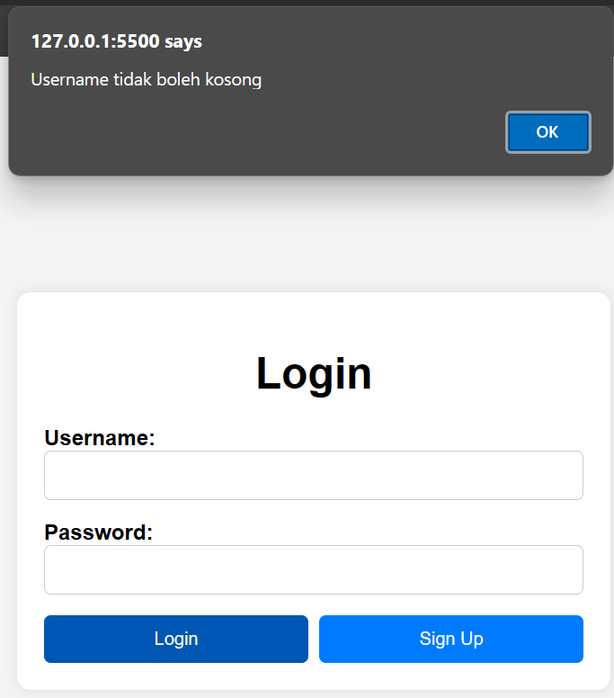
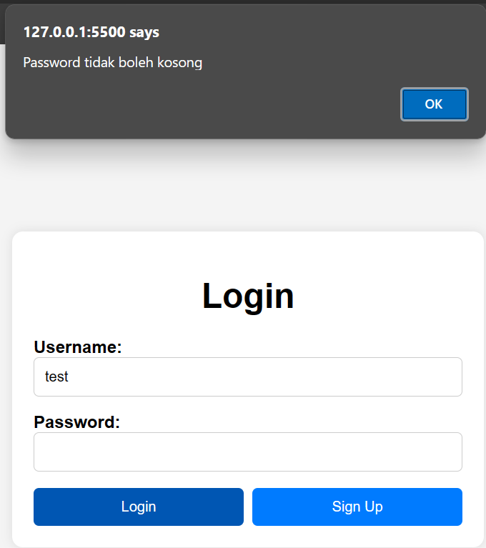

Kita akan memakai kode dibawah ini:
```javascript
function validateForm() {
    var username = document.getElementById("username").value;
    var password = document.getElementById("password").value;

    if (username.trim() == "") {
        alert("Username tidak boleh kosong");
        return false;
    }

    if (password.trim() == "") {
        alert("Password tidak boleh kosong");
        return false;
    }

    return true;
}
```
**1. function validateForm()**: Ini adalah sebuah fungsi JavaScript bernama validateForm(). Fungsi ini bertujuan untuk memeriksa apakah formulir login telah diisi dengan benar sebelum data dikirimkan.

**2. var username = document.getElementById("username").value;**: Dalam baris ini, kita mengambil nilai yang dimasukkan oleh pengguna ke dalam kotak teks username. document.getElementById("username") mengacu pada elemen HTML dengan ID "username", yang biasanya adalah kotak input untuk username dalam formulir.

**3. var password = document.getElementById("password").value;**: Sama seperti sebelumnya, ini adalah cara kita untuk mendapatkan nilai yang dimasukkan oleh pengguna ke dalam kotak teks password.

**4. if (username.trim() == "") { ... }**: Ini adalah sebuah kondisi (if statement) yang memeriksa apakah kolom username kosong. Fungsi trim() digunakan untuk menghapus spasi kosong di awal dan akhir string, sehingga jika yang dimasukkan oleh pengguna hanyalah spasi kosong, kondisi ini akan dianggap sebagai kolom kosong.

**5. alert("Username tidak boleh kosong");**: Jika kolom username kosong, fungsi alert() akan menampilkan pesan peringatan kepada pengguna bahwa mereka harus mengisi kolom username.

**6. return false;**: Jika ada validasi yang gagal, maka fungsi ini akan mengembalikan nilai false, yang akan mencegah formulir untuk dikirimkan.

**7. return true;**: Jika semua validasi berhasil, maka fungsi ini akan mengembalikan nilai true, yang memungkinkan formulir untuk dikirimkan.

Dengan fungsi ini, kita memastikan bahwa pengguna harus mengisi kedua kolom username dan password sebelum mereka dapat melakukan login. Jika mereka mencoba untuk mengirimkan formulir tanpa mengisi kedua kolom tersebut, mereka akan menerima pesan peringatan. Dan hasil akhirnya akan ada animasi seperti ini

**Sistem akan mendeteksi apabila username tidak diisi**


**Sistem akan mendeteksi apabila password tidak diisi**

