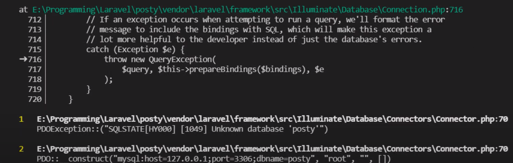
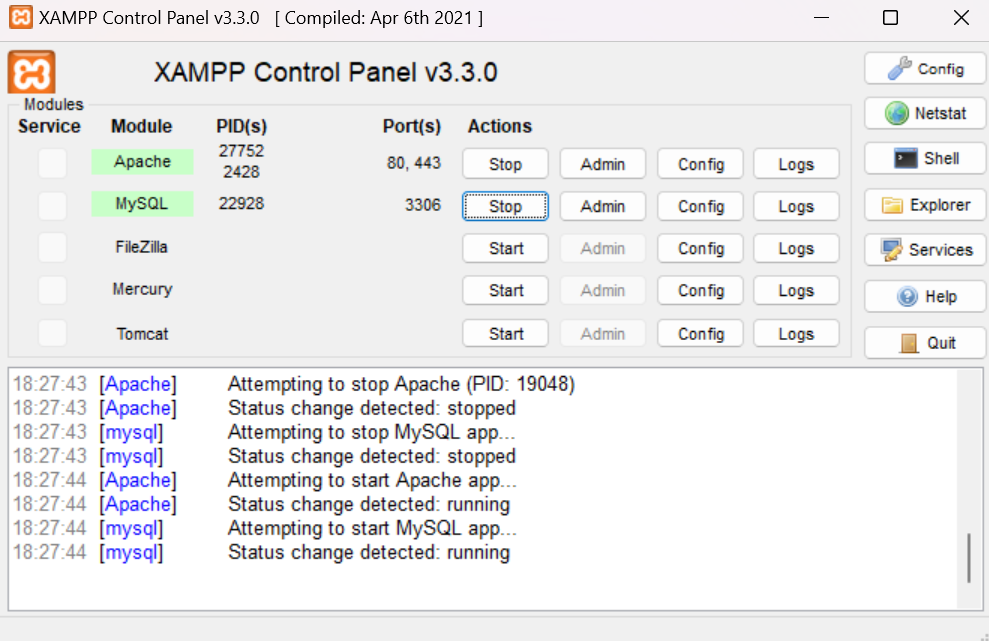
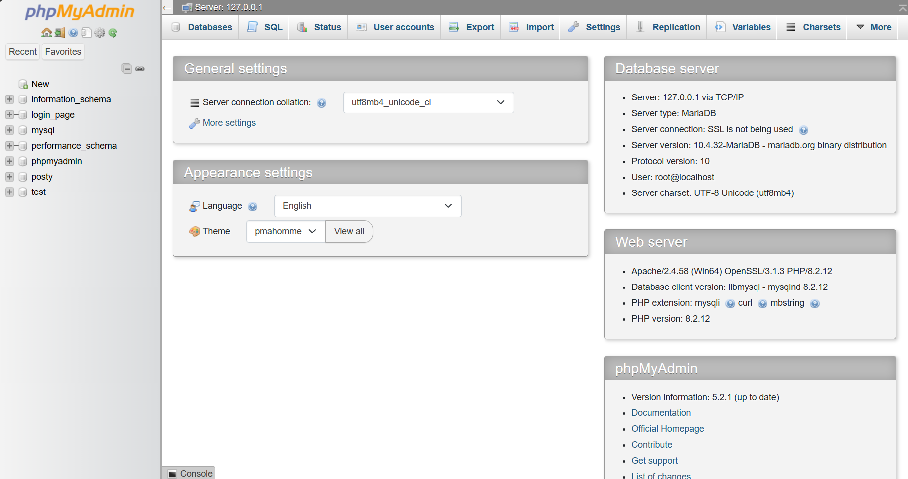
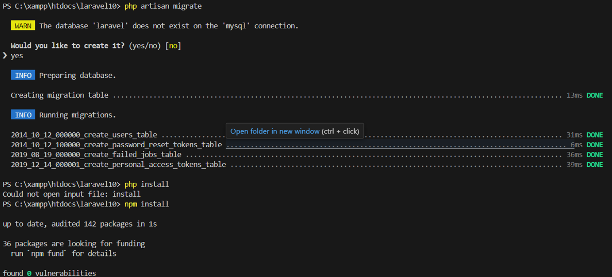

# Sekarang kita mencoba untuk membuat Login dan Register di Laravel 10

Step 1: Buka Terminal baru lalu masuk ke bagian dimana file laravel kalian berada

Contoh:
```
cd C:\xampp\htdocs\example-app
```

Setelah itu masukkan kode dibawah ini untuk Instalasi Modul Laravel UI:
```
composer require laravel/ui
```

Setelah itu lanjutkan modul authentikasi, kodenya dibawah ini:
```
php artisan ui bootstrap --auth
```

Jika berhasil kode akan seperti dibawah ini:


Jika gagal, coba kalian cek di terminal dengan scroll ke atas apakah ada error atau tidak, biasanya terdapat error seperti dibawah ini.


Cara mengatasinya dengan membuka **package.json** di file laravel kalian melalui vscode lalu tambahkan kode ini dibawah "private":
```
"type": "module",
```

Sehingga kode keseluruhan menjadi seperti berikut:

```
{
    "private": true,
    "type": "module",
    "scripts": {
        "dev": "vite",
        "build": "vite build"
    },
    "devDependencies": {
        "@tailwindcss/forms": "^0.5.2",
        "alpinejs": "^3.4.2",
        "autoprefixer": "^10.4.2",
        "axios": "^1.1.2",
        "laravel-vite-plugin": "^0.7.2",
        "postcss": "^8.4.31",
        "tailwindcss": "^3.1.0",
        "vite": "^4.0.0"
    }
}
```

ketika sudah dipastikan kode seperti itu maka jalankan kembali kode ini dan tunggu sampai berhasil.

```
php artisan ui bootstrap --auth
```

Setelah itu buka terminal lalu jalankan perintah.

```
npm install
```

Setelah itu:

```
npm run dev
```

Nanti akan muncul seperti ini di terminal


Buka lagi sebuah terminal baru, dan jalankan server laravel. 
```
php artisan server
```
(npm run dev harus tetap berjalan di terminal lain) setelah itu hasil pada browser, tampilan awal laravel saat ini sudah dilengkapi dengan **login** dan **register**.


Sampai sesi ini, antarmuka sudah jalan. Pada windows, kedua perintah harus dijalankan. (npm run dev) dan (php artisan serve).

# Jika terdapat error dibagian SQL nya contoh seperti ini:



Maka solusi yang bisa kita gunakan adalah menggunakan kode dibawah ini:

Step 1: Cari file bernama **AppServiceProvider.php**

Step 2: Tambahkan kode ini di dalam file 
```
use Illuminate\Support\Facades\Schema;
```
Step 3: Tambahkan juga kode ini didalam file
```
public function boot()
{
    Schema::defaultStringLength(191)
}
```

Sehingga kode keseluruhan menjadi:
```
<?php

namespace App\Providers;

use Illuminate\Support\ServiceProvider;
use Illuminate\Support\Facades\Schema;

class AppServiceProvider extends ServiceProvider
{
    /**
     * Register any application services.
     */
    public function register(): void
    {
        //
    }

    /**
     * Bootstrap any application services.
     */
    public function boot(): void
    {
        Schema::defaultStringLength(191);
    }
}
```

Step 4: cari file bernama **.env**. Dan kosongkan password jika koneksi ke database tidak menggunakan password, atau isikan sesuai password yang telah di atur pada saat instalasi XAMPP.


Step 5: buka aplikasi xampp lalu start apache dan MySQL seperti ini:


Pastikan **DB_PORT** sesuai dengan yang ada di aplikasi xampp

Step 6: Buka website lalu ketik **localhost** lalu klik bagian **phpMyAdmin**


Step 7: Setelah muncul seperti ini.


Website akan berubah seperti ini


Lalu kalian bikin **Database name** sesuai dengan yang ada di file **.env** kalian bisa cek di **DB_DATABASE**

Step 8: Ketika sudah dipastikan nama database nya benar dan portnya benar kalian bisa mengulang kode yang ditaruh di terminal tadi.

```
php artisan migrate:fresh
```
atau
```
php artisan migrate
```

Proses ini melakukan migrasi tabel users dan beberapa table lain yang terdapat pada folder.

Ketika berhasil akan muncul **done** seperti ini


Ketika sudah muncul link nya kalian bisa klik link tersebut dan menuju kesebuah website. Ketika sudah muncul website nya, kalian bisa klik register disebelah kanan atas dan silahkan memasukkan username, password, dan email aktif kalian. Jika sudah berhasil maka akan muncul tulisan seperti ini:


Tunggu update selanjutnya ya :D
