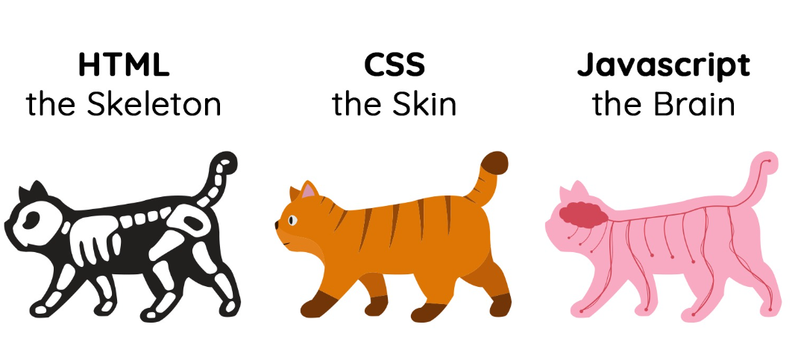

# Instalasi HTML dan CSS untuk Login Page

## Anatomi Website
Pada dasarnya, website dibangun dengan tiga buah fondasi utama:

-**HTML**: sebuah markup language yang menentukan struktur atau kerangka dari halaman web;

-**CSS**: sebuah markup language yang memberikan gaya atau styling agar halaman web ditampilkan lebih ciamik; dan

-**JavaScript**: satu-satunya programming language yang didukung oleh browser untuk meningkatkan interaktivitas pada halaman web.
Perlu ditekankan bahwa ketiga komponen tersebut termasuk hal vital dalam pembangunan web. Sebenarnya, kita bisa saja membangun halaman web tanpa CSS dan JavaScript. Namun, website akan terlihat tidak menarik dan responsif.
### Anggota
1. Firmansyah Achmad Adam
2. Dana Affan Rabbani
3. Haidar Dzaky Musyaffa

selamat belajar lagi !!