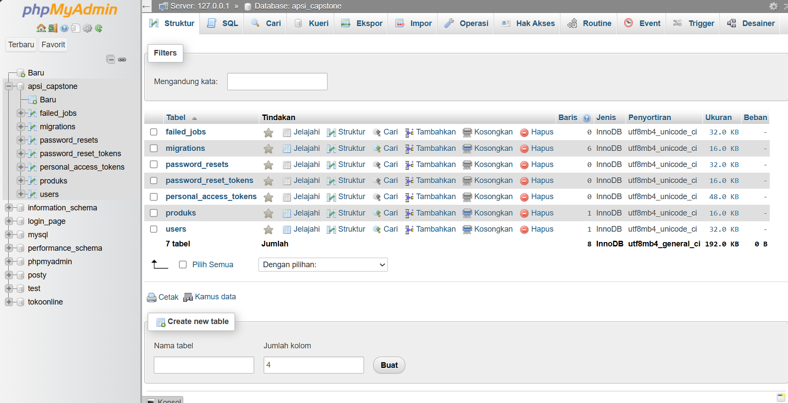
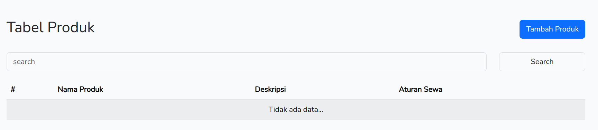
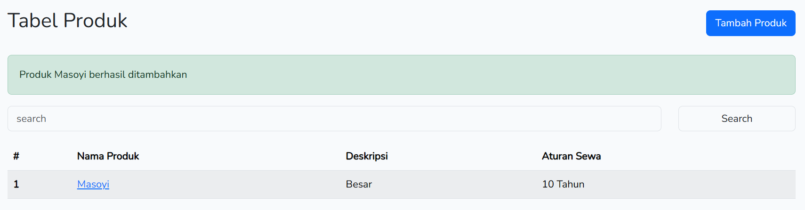

# Membuat Tabel Produks Menggunakan Migration

Kelanjutan dari praktek sebelumnya adalah membuat CRUD (Create Read Update Delete) menggunakan fitur authetikasi yang telah dilakukan pada praktek pertama.

## 1.Membuat Tabel Produks Menggunakan Migration

1. Buka terminal. ketik perintah membuat migration produk beserta model dan controller. **php artisan make:model Produk -mcr**

.png)

2. Buka file database\migrations\2024_03_11_064001_create_produks_table.php. Modifikasi bagian ini.

Pada penamaan file **2024_03_11_064001** didalam vscode masing masing pasti berbeda setelah nama awal 2024, jadi pastikan buka file yang berawalan 2024

```
public function up(): void
{
    Schema::create('produks', function (Blueprint $table) {
        $table->id();
        $table->string('nama_produk', 50);
        $table->text('deskripsi');
        $table->string('aturan_sewa',255);
        $table->string('image', 100);
        $table->timestamps();
    });
}
```

3. Lihat status migration. php artisan migrate:status. Ada satu yang pending yaitu create produks_table.


4. Jalankan database server dari XAMPP

5. Ketik perintah migrate pada terminal **php artisan migrate**


6. Periksa database, kini sudah ada tambahan tabel **produks**



# 2 Buat route menuju ProdukController

1. Tambahkan baris perintah ini pada route di file **web.php**

```
use App\Http\Controllers\ProdukController;
```

dan

```
Route::resource('produks',ProdukController::class)->middleware('auth');
```

2. Penjelasan baris perintah di atas sebegai berikut. Route::resource mewakili 7 route lain, yakni untuk fungsi: index, create, store, show, edit, update, dan destroy. Lengkapnya bisa dilihat dengan menjalankan perintah **php artisan route:list**

Bagian **->middleware('auth')** berarti semua route ini hanya bisa diakses bagi user yang sudah login.

# 3. Persiapkan Model Produk

1. Buka file **app\Models\produk.php**, dan tambahkan protected **$guarded = [];**

```
class Produk extends Model
{
    use HasFactory;
    //Tambahan untuk melakukan mass assignment
    protected $guarded = [];
}
```

# 4. Persiapkan ProdukController

1. Buka file **app\Http\Controllers\ProdukController**.php. Lakukan modifikasi sebagaimana dicontohkan di bawah ini.

```
use App\Models\Produk;
use Illuminate\Http\Request;
// Dua baris tambahan
use Illuminate\Http\Response;
use Illuminate\Http\RedirectResponse;

class ProdukController extends Controller
{
    public function index()
    {
        //Baris ini mengarahkan ke folder produk, file index.blade.php
        return response()->view('produk.index',['produks'=>Produk::all()]);
    }

    public function create()
    {
        //Baris ini mengarahkan ke folder produk, file create.blade.php
        return response()->view('produk.create');
    }

    public function store(Request $request)
    {
        $validateData = $request->validate(
            [
                'nama_produk'   => 'required',
                'deskripsi' => 'required',
                'image' => 'image|mimes:jpg,png,jpeg,gif,svg|max:2048'
                // 'jumlah' => 'required|min:10|integer'
            ]
            );

        if($request->file('image')){
            $file= $request->file('image');
            $filename= date('YmdHi').$file->getClientOriginalName();
            $file-> move(public_path('public/img'), $filename);
            $validateData['image']=$filename;
        }
        // Tambah untuk atribut yang tidak memakai feedback validasi.
        $validateData['aturan_sewa']=$request->aturan_sewa;
    
        Produk::create($validateData);
		// Setelah memasukkan data, kemudian di arahkan ke URL ini.
        return redirect('/produks')->with('pesan',"Produk $request->nama_produk berhasil ditambahkan");
    }

    public function show(Produk $produk)
    {
        //Baris ini mengarahkan ke folder produk, file show.blade.php
        return response()->view('produk.show', compact('produk'));
    }

    public function edit(Produk $produk)
    {
        //Baris ini mengarahkan ke folder produk, file edit.blade.php
        return response()->view('produk.edit',compact('produk'));
    }

    public function update(Request $request, Produk $produk)
    {
        $validateData = $request->validate([
                'nama_produk'   => 'required',
                'deskripsi' => 'required'
                // 'jumlah' => 'required|min:10|integer'
        ]);
        $produk->update($validateData);
		// Setelah update data, kemudian di arahkan ke URL ini.
        return redirect('/produks/'.$produk->id)->with('pesan',"Produk $produk->nama_produk berhasil diupdate");
    }

    public function destroy(Produk $produk)
    {
        $produk->delete();
		// Setelah menghapus data, kemudian di arahkan ke URL ini.
        return redirect('/produks')->with('pesan',"Produk $produk->nama_produk berhasil dihapus");
    }
}
```

2. Penjelasan baris-baris perintah pada ProdukController

- index() berfungsi menampilkan data produk. Proses retrieve data menggunakan model Produk::all() yang dikirim ke halaman produk.index. Data produk pada view akan berupa array dengan nama $produk.

- create() menampilkan halaman form penambahan produk melalui view produk.view

- store() untuk memproses inputan form produk. Ada proses validasi terhadap isian dari form, sehingga jika sesuai maka data disimpan ke dalam database dengan perintah Produk::create($validateData). Selanjutnya proses redirect ke /produks disertai pesan flash.

- show() berfungsi menampilkan sebuah data produk. Pada contoh di atas menggunakan fungsi compact(). Bisa juga menggunakan bentuk array

```
return response()->view('produk.show',['produk' => $produk]);
```

- edit() akan menampilkan form edit melalui view produk.edit

- update() memproses hasil update.

- destroy() untuk menghapus data produk.

**Proses menampilkan view (index, create, show, edit) berupa return type dalam bentuk Response object. Penulisannya harus response()->view('folder.file.blade).**

**Proses menampilkan view (store, update, destroy) menggunakan return type dalam bentuk RedirectResponse object berupa redirect('/produks'). Standar penulisan langsung ke URL tidak berubah.**

# 5. Persiapkan View

## 5.1 View layouts\app.blade.php
Tambahkan menu di **layouts\app.blade.php**, pada bagian **@auth ... @endauth**

## 5.2 View produk\index.blade.php
1. Buat view index.blade.php, letakkan di dalam folder views/produk. Demikian juga untuk view lainnya.

```
@extends('layouts.app')

@section('content')
<div class="container mt-3">
    <div class="row">
        <div class="col-12">
            <div class="py-4 d-flex justify-content-between align-items-center">
            <h1 class="h2">Tabel Produk</h1>
            <a href="{{url('/produks/create')}}" class="btn btn-primary">Tambah Produk
            </a>
            </div>

            @if(session()->has('pesan'))
                <div class="alert alert-success" role="alert">
                {{ session()->get('pesan')}}
                </div>
            @endif

            <table class="table table-striped">
                <thead>
                    <tr>
                        <th>#</th>
                        <th>Nama Produk</th>
                        <th>Deskripsi</th>
                        <th>Aturan Sewa</th>
                    </tr>
                </thead>
                <tbody>
                @forelse ($produks as $prod)
                <tr>
                    <th>{{$loop->iteration}}</th>
                    <td>
                    <a href="{{ url('/produks/'.$prod->id) }}"> {{$prod->nama_produk}}</a>
                    </td>
                    <td>{{$prod->deskripsi}}</td>
                    <td>{{$prod->aturan_sewa}}</td>
                </tr>
                @empty
                <td colspan="6" class="text-center">Tidak ada data...</td>
                @endforelse
                </tbody>
            </table>

        </div>
    </div>
</div>
@endsection
```

2. Hasil ketika data belum ada.


3. Hasil ketika sudah ada data (silahkan dilihat setelah proses tambahkan produk selesai) contoh seperti ini:



## 5.3 View produk\create.blade.php

1. Buat view **create.blade.php** di dalam folder views/produk

```
@extends('layouts.app')

@section('content')
<div class="container mt-3">
    <div class="row">
        <div class="col-sm-8 col-md-6">
            <h1 class="h2 pt-4">Penambahan Produk</h1>
            <hr>

            <form action="{{url('/produks')}}" method="POST" enctype="multipart/form-data">
            @csrf
            <div class="mb-3">
                <label class="form-label" for="nama_produk">Nama Produk</label>
                <input type="text" class="form-control @error('nama_produk') is-invalid @enderror" id="nama_produk" name="nama_produk" value="{{ old('nama_produk') }}">
                @error('nama_produk')
                    <div class="text-danger">{{ $message }}</div>
                @enderror
            </div>

            <div class="mb-3">
                <label class="form-label" for="deskripsi">Deskripsi</label>
                <input type="text" class="form-control @error('deskripsi') is-invalid @enderror" id="deskripsi" name="deskripsi" value="{{ old('deskripsi') }}">
                @error('deskripsi')
                    <div class="text-danger">{{ $message }}</div>
                @enderror
            </div>

            <div class="mb-3">
                <label class="form-label" for="aturan_sewa">Aturan Sewa</label>
                <input type="text" class="form-control @error('aturan_sewa') is-invalid @enderror" id="aturan_sewa" name="aturan_sewa" value="{{ old('aturan_sewa') }}">
                @error('aturan_sewa')
                    <div class="text-danger">{{ $message }}</div>
                @enderror
            </div>

            <div class="mb-3">
                <label class="form-label" for="image">Image</label>
                <input type="file" placeholder="Choose image" class="form-control @error('image') is-invalid @enderror" id="image" name="image" value="{{ old('image') }}">
                @error('image')
                    <div class="text-danger">{{ $message }}</div>
                @enderror
            </div>

            <button type="submit" class="btn btn-primary my-2">Simpan</button>
        </form>

        </div>
    </div>
</div>
@endsection
```

2. Penjelasan
- **@csrf** adalah instruksi dalam template Blade untuk memasukkan token CSRF ke dalam formulir HTML. CSRF (Cross-Site Request Forgery) adalah serangan keamanan di mana penyerang mencoba memanipulasi tindakan yang dilakukan oleh pengguna yang sah di situs web yang terkena.

- Token CSRF dihasilkan secara otomatis oleh Laravel untuk setiap sesi pengguna. Ketika menggunakan @csrf dalam formulir Blade, Laravel akan memasukkan token ini ke dalam formulir tersebut. Saat formulir tersebut dikirimkan, token ini akan diverifikasi oleh Laravel untuk memastikan bahwa permintaan yang dibuat berasal dari pengguna yang sah di aplikasi tersebut, dan bukan dari serangan CSRF.

- Pada bagian ini fungsinya menampilkan pesan jika ada error ketika data yang diinputkan melalui formulir tidak sesuai dengan ketentuan pada proses validasi. variabel harus disesuaikan dengan atribut pada class bagian input.

```
@error('nama_produk')
    <div class="text-danger">{{ $message }}</div>
@enderror
```

3. Modifikasi controller pada bagian fungsi store.

```
public function store(Request $request)
{
    $validateData = $request->validate(
        [
            'nama_produk'   => 'required',
            'deskripsi' => 'required',
            'image' => 'image|mimes:jpg,png,jpeg,gif,svg|max:2048'
            // 'jumlah' => 'required|min:10|integer'
        ]
        );

    if($request->file('image')){
        $file= $request->file('image');
        $filename= date('YmdHi').$file->getClientOriginalName();
        $file-> move(public_path('img'), $filename);
        $validateData['image']=$filename;
    }
    // Tambah atribut yang tidak memakai validasi. 
    $validateData['aturan_sewa']=$request->aturan_sewa;
    /*
    Cara Lain tidak memakai mass assignment
    $data= new Produk();

    if($request->file('image')){
        $file= $request->file('image');
        $filename= date('YmdHi').$file->getClientOriginalName();
        $file-> move(public_path('public/img'), $filename);
        $data['image']= $filename;
    }
    $data->save();
    */

    // kalau pakai mass assignment di model harus ada
    // protected $guarded = [];
    Produk::create($validateData);
    return redirect('/produks')->with('pesan',"Produk $request->nama_produk berhasil ditambahkan");
}
```

4. Jangan lupa membuat folder img di dalam folder public **(public/img)**.

5. Coba lakukan proses penambahan data. dan lihat hasilnya.

## 5.4 View produk\show.blade.php